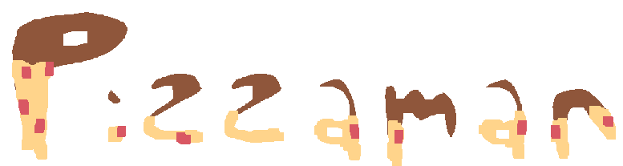

# Feed your customers!
Feed all the customers that get in your way. Avoid them leaving the place!

## Gameplay
W&S to move, A&D to change direction

E for action (if watching to the left, throw a pizza, if watching to the right, grab a pizza)

For each customer you feed, you gain points. If they leave, you lose!

## Playing
- compiling: You'll need to have the raylib header file
- you can also play it on itch.io: https://eviluser7.itch.io/pizzaman